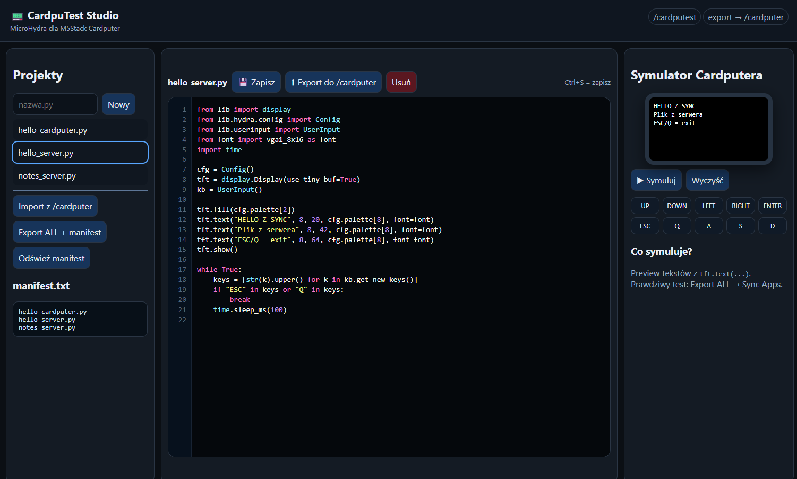

# 📟 Cardputer Remote Sync Hub

A MicroPython application for Cardputer that enables wireless app synchronization from a remote server to your device's SD card.

---

## 🚀 Features

- 📶 **WiFi Connection** — connect to local networks  
- 🌐 **Remote App Sync** — download apps from your server  
- 💾 **SD Card Integration** — saves apps to `/sd/apps`  
- 📦 **Auto Menu Integration** — apps appear automatically  
- 🔁 **Manifest-based updates**

---

## 📋 Prerequisites

1. Cardputer device with MicroHydra firmware  
2. SD card  
3. WiFi network (2.4GHz)

---

## ⚙️ Setup

### 1. Configure the App

```python
WIFI_SSID = "YourNetworkName"
WIFI_PASS = "YourPassword"
BASE_URL = "http://example.com/cardputer"
```

---

### 2. Prepare the Server

```
/cardputer/
├── manifest.txt
└── apps/
    ├── my_app.py
    └── game.py
```

Example `manifest.txt`:

```
apps/my_app.py
apps/game.py
```

---

### 3. Install to Cardputer

```
SD:/app/remote_sync_hub.py
```

---

## ▶️ Usage

### First Time Setup

1. Launch `remote_sync_hub`
2. Press **1** to connect WiFi
3. Wait for connection

### Sync Apps

1. Press **4**
2. Apps download automatically
3. Saved to `/sd/apps`
4. Appear in menu

---

## 🎮 Controls

| Key       | Action        |
|----------|--------------|
| 1        | WiFi connect |
| 2        | Sync apps    |
| 3        | Scan WiFi    |
| ESC / Q  | Exit         |

---

## ⚙️ How It Works

1. Connect WiFi  
2. Download `manifest.txt`  
3. Download files  
4. Save to SD  
5. Menu auto-detects apps  

---

## 🛠 Troubleshooting

- ❌ WiFi — check credentials (2.4GHz only)  
- ❌ Sync — check server + manifest  
- ❌ Apps missing — verify `/sd/apps/`  

---

# 🧠 CardpuTest Studio

A lightweight web-based development environment for creating, testing, and exporting MicroHydra apps for the Cardputer.



---

## ✨ Features

- 🎨 Syntax highlighting editor  
- 🧪 Live preview (simulator)  
- 📁 Project manager  
- 🚀 Export to `/cardputer`  
- 📜 Auto manifest generator  
- 🔄 Import from server  

---

## 📂 Directory Structure

```
cardputest/
├── index.php
├── .htaccess
└── projects/
```

---

## ⚙️ How It Works

```
Browser Editor
      ↓
/cardputest/projects
      ↓
Export
      ↓
/cardputer
      ↓
Remote Sync Hub
      ↓
Cardputer (/sd/apps)
```

---

## 🛠 Setup

1. Upload `cardputest` to server  
2. Create `/cardputer` folder  
3. Open:

```
http://your-domain.com/cardputest/
```

---

## 🔁 Workflow

1. Create app in browser  
2. Click **Export ALL + manifest**  
3. Run Remote Sync Hub  
4. Sync  
5. Done 🎉  

---

## 🧾 Notes

- Apps must be `.py`  
- Use `ESC` or `Q` to exit  
- Simulator = preview only  

---

## 💡 Example App

```python
from lib import display
from lib.hydra.config import Config

cfg = Config()
tft = display.Display(use_tiny_buf=True)

tft.fill(cfg.palette[2])
tft.text("Hello Cardputer!", 10, 30, cfg.palette[8])
tft.show()
```

---

## 🔥 Full Workflow

```
CardpuTest Studio → Server (/cardputer) → Remote Sync Hub → Cardputer
```

👉 Write → Sync → Test (no SD swapping)

---

## 📄 License

MIT License
